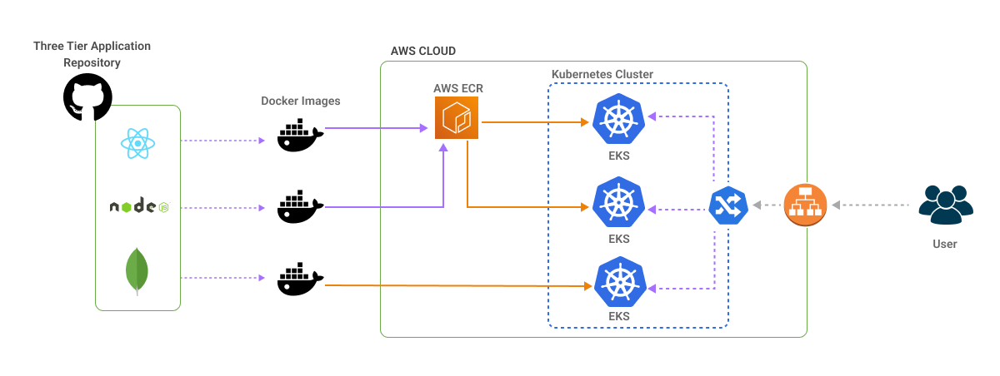

# #Three-Tier Web Application Deployment Documentation

## Introduction 
This documentation provides detailed steps for deploying a Three-Tier Web Application using ReactJS, NodeJS, and MongoDB on AWS EKS (Elastic Kubernetes Service) for the #TWSThreeTierAppChallenge. It includes setting up an EKS cluster, using private ECR repositories for image management, and employing AWS CLI and Helm for infrastructure management.

**Here is the Infrastructure**


**Application Code: Contains the frontend and backend implementations.**

**Kubernetes Manifests: Customizable files for deploying the app on AWS EKS.**

**High-Level Overview: IAM user setup, EKS Cluster, and Load Balancer configuration for seamless routing.**


## Deployment Highlights & Project Details
**Infrastructure Setup:**
- Configures IAM, EC2, ECR, and EKS for secure and scalable hosting.
  
**Docker Images:**
- Builds and pushes frontend and backend images to AWS ECR.
  
**Cluster & Networking:**
- Creates a three-tier cluster with Kubernetes manifest files and deploys AWS Load Balancer Controller.


***Let's Start,***
### Step 1: IAM Configuration
- Create a user `eks-admin` with `AdministratorAccess`.
- Generate Security Credentials: Access Key and Secret Access Key.

### Step 2: EC2 Setup
- Launch an Ubuntu instance in the region `us-east-1`.
- SSH into the instance from your local machine.

### Step 3: Install AWS CLI v2
``` shell
curl "https://awscli.amazonaws.com/awscli-exe-linux-x86_64.zip" -o "awscliv2.zip"
sudo apt install unzip
unzip awscliv2.zip
sudo ./aws/install -i /usr/local/aws-cli -b /usr/local/bin --update
aws configure      #AWS Access Key ID & Secret Access Key [IAM]
```

### Step 4: Install Docker
``` shell
aws ecr-public get-login-password --region us-east-1 | docker login --username AWS --password-stdin 
sudo apt-get update
sudo apt install docker.io
docker ps
sudo chown $USER /var/run/docker.sock
```

### Step 4: Create Docker images on ECR
For Frontend:
``` shell
docker build -t three-tier-frontend .
docker tag three-tier-frontend:latest public.ecr.aws/z4u5w8e4/three-tier-frontend:latest
docker push public.ecr.aws/z4u5w8e4/three-tier-frontend:latest
docker run -d -p 3000:3000 three-tier-frontend:latest
docker logs [CONTAINER ID]
```
For Backend:
``` shell
docker build -t three-tier-backend .
docker tag three-tier-backend:latest public.ecr.aws/z4u5w8e4/three-tier-backend:latest
docker push public.ecr.aws/z4u5w8e4/three-tier-backend:latest
docker run -d -p 3500:3500 three-tier-backend:latest
docker logs [CONTAINER ID]
```


### Step 5: Install kubectl
#### Installing AWS CLI, Docker, kubectl, eksctl, and other dependencies: Run installation commands directly on the machine or EC2 instance where you'll be deploying the app. These installations are not part of the project code repository.

``` shell
curl -o kubectl https://amazon-eks.s3.us-east-1.amazonaws.com/1.19.6/2021-01-05/bin/linux/amd64/kubectl
chmod +x ./kubectl
sudo mv ./kubectl /usr/local/bin
kubectl version --short --client
```

### Step 6: Install eksctl
``` shell
curl --silent --location "https://github.com/weaveworks/eksctl/releases/latest/download/eksctl_$(uname -s)_amd64.tar.gz" | tar xz -C /tmp
sudo mv /tmp/eksctl /usr/local/bin
eksctl version
```

### Step 7: Setup EKS Cluster
``` shell
eksctl create cluster --name three-tier-cluster --region us-east-1 --node-type t2.medium --nodes-min 2 --nodes-max 2
aws eks update-kubeconfig --region us-east-1 --name three-tier-cluster
kubectl get nodes
```

### Step 8: Run Manifests
#### In the Manifest folder, create .yaml manifest files such as the Deployment, Service, Secret, Persistent Volume (PV), Persistent Volume Claim (PVC), and Ingress files for the Frontend, Backend, and MongoDB components. Apply each manifest using kubectl.
``` shell
kubectl create namespace three-tier
kubectl apply -f .
kubectl delete -f .
kubectl get all
kubectl get pods -n three-tier
kubectl describe pod [pod name] -n three-tier
kubectl get deployment -n three-tier

# After the following steps:
kubectl apply -f service.yaml
apply -f backend-deployment.yaml
apply -f backend-service.yaml
kubectl get pods -n three-tier
kubectl logs [pod name] -n three-tier
```

#### Encode Decode command for Secret .yaml file:
``` shell
echo "admin" | base64 --encode
echo "cGFzc3dvcmQxMjM=" | base64 --decode
```

### Step 9: Install AWS Load Balancer
``` shell
curl -o iam-policy.json https://raw.githubusercontent.com/kubernetes-sigs/aws-load-balancer-controller/main/docs/install/iam-policy.json
aws iam create-policy --policy-name AWSLoadBalancerControllerIAMPolicy --policy-document
file://iam_policy.json
eksctl utils associate-iam-oidc-provider --region=us-east-1 --cluster=three-tier-cluster --approve
eksctl create iamserviceaccount --cluster=three-tier-cluster --namespace=kube-system --name=aws-load-balancer-controller --role-name AmazonEKSLoadBalancerControllerRole --attach-policy-arn=arn:aws:iam::[Account ID]:policy/AWSLoadBalancerControllerIAMPolicy --approve --region=us-east-1
```

### Step 10: Deploy AWS Load Balancer Controller
``` shell
sudo snap install helm --classic
helm repo add eks https://aws.github.io/eks-charts
helm repo update eks
helm install aws-load-balancer-controller eks/aws-load-balancer-controller \
  --set clusterName=three-tier-cluster \
  --set serviceAccount.create=false \
  --set serviceAccount.name=aws-load-balancer-controller \
  -n kube-system

kubectl get deployment -n kube-system aws-load-balancer-controller
kubectl logs -n kube-system deployment/aws-load-balancer-controller

helm status aws-load-balancer-controller -n kube-system
helm uninstall aws-load-balancer-controller -n kube-system
kubectl delete serviceaccount aws-load-balancer-controller[name] -n kube-system
kubectl get serviceaccounts -n kube-system
kubectl get events -n kube-system
kubectl get pods -A
kubectl get pods -n kube-system
kubectl get pod -n three-tier
kubectl get nodes
helm list -a -A 

```

#### Check the AWS Host Address by retrieving the external IP or DNS for the Load Balancer associated with your EKS cluster. Once obtained, update this address in the frontend-deployment.yml file and the full_stack_lb.yaml Ingress file to ensure proper routing and connectivity. This step is crucial for directing frontend traffic to the correct AWS endpoint.
``` shell
kubectl get ingress mainlb -n three-tier
kubectl apply -f full_stack_lb.yaml
```

#### To verify that data is correctly reaching the database, run the following command:
``` shell
kubectl exec -it [mongodb pod name] -n three-tier -- /bin/sh
- mongo
- show dbs
- use [name(todo)]
- exit
```

### Cleanup
- To delete the EKS cluster:
``` shell
eksctl delete cluster --name three-tier-cluster --region us-east-1
```

---
Successfully Completed! 🚀👨‍💻
